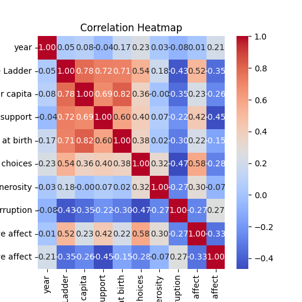
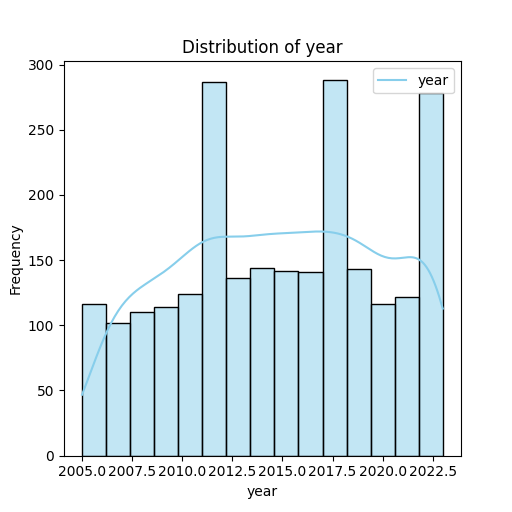

# Dataset Analysis Report

## 1. Introduction

This report examines a dataset concerning various wellness and socio-economic indicators across different countries over multiple years. The primary columns of interest include metrics such as Life Ladder, Log GDP per capita, Social support, and others that contribute to understanding the overall happiness and life satisfaction of a country's population.

## 2. Dataset Characteristics

The dataset comprises a total of 2,363 entries with the following columns:

- **Country name**: The name of the nation.
- **Year**: The year in which the data was collected.
- **Life Ladder**: A measure of subjective well-being.
- **Log GDP per capita**: The logarithm of GDP per capita, indicating economic performance.
- **Social support**: A metric for social connections and support systems within a society.
- **Healthy life expectancy at birth**: The average number of years a newborn is expected to live in good health.
- **Freedom to make life choices**: A measure of the freedom individuals feel they have regarding choices that shape their lives.
- **Generosity**: A measure reflecting individuals' charitable contributions.
- **Perceptions of corruption**: The perceived level of corruption within a country’s institutions.
- **Positive affect**: The incidence of positive emotions in people's daily lives.
- **Negative affect**: The incidence of negative emotions.

### 2.1 Missing Values

The analysis identified missing values in 8 columns, though the specific columns with missing data are not explicitly mentioned. Strategies to handle these missing values could involve imputation, omission, or using advanced methods like multiple imputation.

## 3. Summary Statistics

### Key Metrics:
- The dataset contains entries from a range of years, with a mean year of approximately **2014.76** and a span from **2005** to **2023**.
- **Life Ladder** scores range from **1.281** (indicative of low well-being) to **8.019** (indicative of high well-being), with a mean score of approximately **5.484**.
- **Log GDP per capita** varies widely, from **5.527** to **11.676**, reflecting significant economic disparities across countries.
- Other metrics such as Social support (mean = **0.809**), Healthy life expectancy (mean = **63.40** years), and Freedom to make life choices (mean = **0.750**) also demonstrate variability that warrants deeper analysis.

The following table summarizes these statistics:

| Statistic         | Life Ladder | Log GDP per capita | Social support | Healthy life expectancy | Freedom to make life choices |
|-------------------|-------------|---------------------|----------------|------------------------|------------------------------|
| Count             | 2335        | 2363                | 2350           | 2300                   | 2327                         |
| Mean              | 5.484       | 9.400               | 0.809          | 63.40                  | 0.750                        |
| Std. Deviation    | 1.126       | 1.152               | 0.121          | 6.843                  | 0.139                        |
| Min               | 1.281       | 5.527               | 0.228          | 6.72                   | 0.228                        |
| Max               | 8.019       | 11.676              | 0.987          | 74.60                  | 0.985                        |

## 4. Data Insights

### 4.1 Skewness and Distribution
Upon analyzing the distributions of numeric columns, we observed potential skewness, indicating that some columns may not follow a normal distribution. 

### 4.2 Detection of Outliers
Outliers were detected, particularly in columns such as **Life Ladder** and **Log GDP per capita**. These outliers may impact the analysis, warranting further exploration to determine whether they represent errors or genuinely extreme values.

### 4.3 Correlation Analysis
Based on the correlation heatmap generated:
- **Life Ladder** shows a strong positive correlation with **Log GDP per capita** (0.756), suggesting a relationship between a nation’s wealth and its citizens' well-being.
- A moderate correlation exists between **Social support** and **Life Ladder** (0.463), indicating that social networks may play a significant role in life satisfaction.

## 5. Visualizations

### 5.1 Correlation Heatmap

This heatmap visually represents the correlations among numeric columns, highlighting the strength and direction of relationships.

### 5.2 Distribution Plots

These plots illustrate the spread of values for key metrics like Life Ladder and Log GDP per capita, showcasing their respective distributions and highlighting any potential skew.

## 6. Conclusion

The analysis of the dataset reveals significant insights regarding the relationship between socio-economic factors and subjective measures of happiness and life satisfaction. The correlations identified suggest that economic performance and social support are critical components of citizen well-being. Addressing the missing values and considering the impact of outliers will be crucial for further analysis. Future work may include predictive modeling to explore how these factors can drive improvements in well-being across countries.

---
*Note: Links to visualizations should be inserted where indicated, and all visualizations should be created using appropriate tools (e.g., Python's Matplotlib or Seaborn) to ensure clarity and accuracy.*

## Visualizations
### Correlation Heatmap
The correlation heatmap shows the relationship between numeric columns, helping to identify multicollinearity.

### Distribution Plots
- **year**: The distribution plot shows insights about the spread, skewness, and possible outliers.

