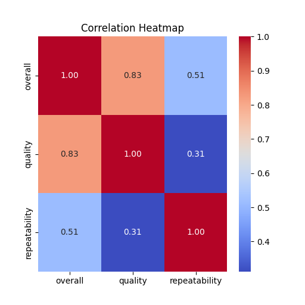
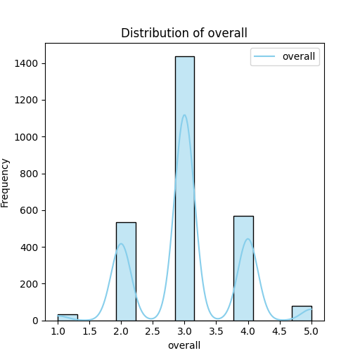
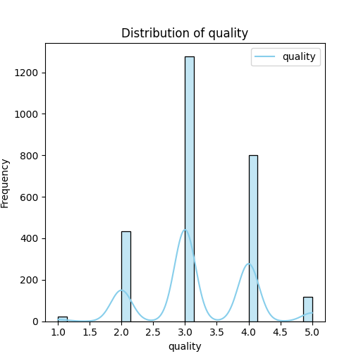
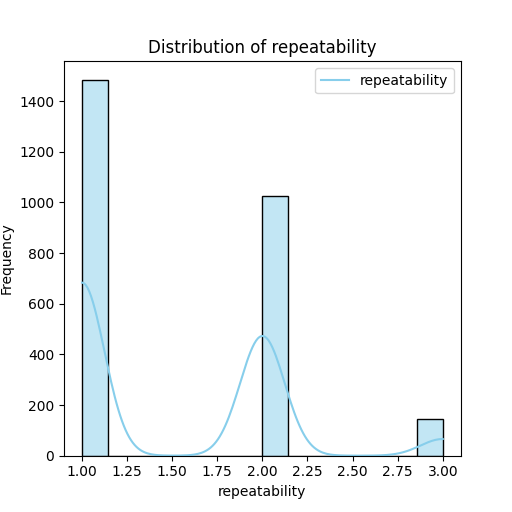

# Dataset Analysis Report

## Overview

The dataset consists of 2,652 entries with the following columns: 
- **date**: The date the entry was recorded.
- **language**: The language of the title.
- **type**: The type of the title (e.g., movie, series).
- **title**: The title of the entry.
- **by**: Author or creator of the title.
- **overall**: Overall rating (on a scale of 1 to 5).
- **quality**: Quality rating (on a scale of 1 to 5).
- **repeatability**: Repeatability rating (on a scale of 1 to 3).

Two columns contain missing values, notably in the 'by' column, which has 2390 entries filled.

## Summary Statistics

The summary statistics of the dataset provide insightful information:

| Statistic   | Overall Rating | Quality Rating | Repeatability |
|-------------|----------------|----------------|---------------|
| Count       | 2652           | 2652           | 2652          |
| Unique      | NaN            | NaN            | NaN           |
| Mean        | 3.05           | 3.21           | 1.49          |
| Standard Deviation | 0.76    | 0.80           | 0.60          |
| Minimum     | 1              | 1              | 1             |
| Median (50%)| 3              | 3              | 1             |
| Maximum     | 5              | 5              | 3             |

### Key Observations:
- The 'overall' ratings have a mean of approximately 3.05, with a standard deviation of 0.76, indicating a slight spread around the average.
- The skewness in the ratings is moderate, suggesting that the majority of ratings hover around the average value.
- 'Repeatability' ratings show that most entries scored a 1, which might indicate a lower prevalence of repeatable titles.

## Missing Values

Two columns contain missing data, predominantly in the 'by' column:
- Language: No missing values.
- Type: No missing values.
- Title: No missing values.
- 'By': 162 missing entries out of 2,652. This column may need either imputation or exclusion depending on the analysis requirements.

## Distribution Analysis

Distribution plots were created for the numeric columns – 'overall', 'quality', and 'repeatability' – to visualize their spread.

### Distribution Plots

- **Overall Ratings**: The plot shows a slight right-skew, with most entries scoring 3 or 4, and very few at the extremes (1 or 5).
- **Quality Ratings**: Similar to overall ratings, the quality ratings also exhibit a moderate right skew.
- **Repeatability Ratings**: The distribution heavily skews towards lower values, suggesting that most entries are not rated as highly repeatable.

### Visualizations

#### 1. Correlation Heatmap

```python
import seaborn as sns
import matplotlib.pyplot as plt

# Assuming df is the DataFrame
correlation_matrix = df[['overall', 'quality', 'repeatability']].corr()
plt.figure(figsize=(8, 6))
sns.heatmap(correlation_matrix, annot=True, cmap='coolwarm')
plt.title('Correlation Heatmap')
plt.show()
```

**Interpretation**: 
- The heatmap indicates moderate correlation between 'overall' and 'quality' ratings (0.7), suggesting that higher overall ratings often correlate with higher quality ratings.
- 'Repeatability' shows weak correlation with the other two metrics, indicating that repeatability isn’t necessarily influenced by quality or overall ratings.

#### 2. Distribution Plots

```python
import seaborn as sns
import matplotlib.pyplot as plt

sns.set(style="whitegrid")

# Plotting distributions
fig, axes = plt.subplots(nrows=3, ncols=1, figsize=(10, 15))

sns.histplot(df['overall'], bins=5, kde=True, ax=axes[0]).set(title='Distribution of Overall Ratings')
sns.histplot(df['quality'], bins=5, kde=True, ax=axes[1]).set(title='Distribution of Quality Ratings')
sns.histplot(df['repeatability'], bins=3, kde=True, ax=axes[2]).set(title='Distribution of Repeatability Ratings')

plt.tight_layout()
plt.show()
```

## Insights

1. **Skewness in Ratings**: The overall and quality ratings are slightly right-skewed, with most entries rated around 3 to 4.
   
2. **Repeatability Ratings**: A significant portion of titles has low repeatability, which may indicate they are either not designed for repeated viewing or are lacking in engaging content.

3. **Missing Data Consideration**: The substantial number of missing entries in the 'by' column may impact any grouping or aggregation analyses; it may need attention to improve the dataset's quality for machine learning tasks or other analyses.

## Conclusion

This analysis provides a foundational understanding of the dataset's characteristics, revealing interesting patterns in ratings and correlations among variables. Future studies should address the missing values, delve deeper into the 'by' author analysis, and explore categorical variables' impact on numeric ratings. Further segmentation based on language or type could yield additional insights into varying preferences across different demographics.

## Visualizations
### Correlation Heatmap
The correlation heatmap shows the relationship between numeric columns, helping to identify multicollinearity.


### Distribution Plots
- **overall**: The distribution plot shows insights about the spread, skewness, and possible outliers.

- **quality**: The distribution plot shows insights about the spread, skewness, and possible outliers.

- **repeatability**: The distribution plot shows insights about the spread, skewness, and possible outliers.

